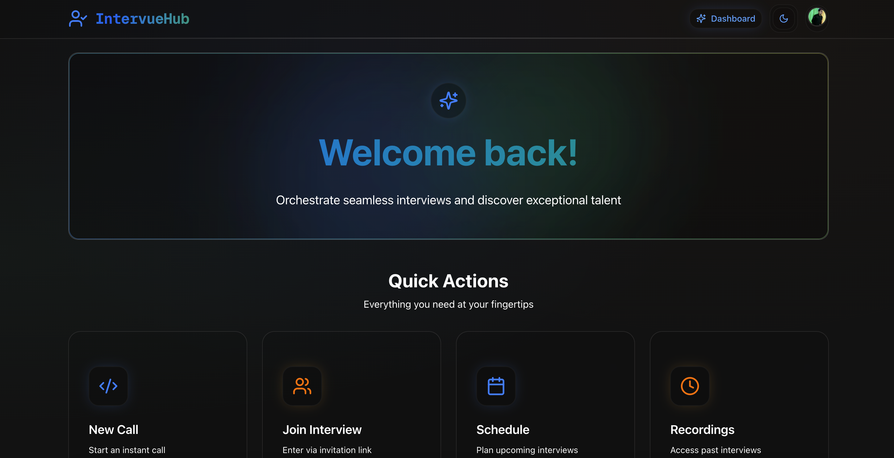

# IntervueHub 🎯

**A interview platform for seamless technical interviews with real-time collaboration.**



## ✨ Features

### 🎥 **Video Conferencing**
- High-quality video calls powered by Stream.io
- Multiple layout options (Grid & Speaker view)
- Real-time participant management
- Meeting recordings with playback

### 👨‍💻 **Live Code Editor**
- Monaco Editor with syntax highlighting
- Support for JavaScript, Python, and Java
- Pre-built coding challenges
- Real-time collaborative coding
- Resizable interface panels

### 📅 **Interview Management**
- Schedule interviews with multiple interviewers
- Candidate and interviewer role management
- Interview status tracking (upcoming, completed, succeeded, failed)
- Comments and rating system

### 🎨 **Liquid Glass UI/UX**
- Modern glassmorphism design
- Smooth animations and transitions
- Professional blue-emerald-orange color palette
- Minimal yet engaging interface
- Dark/Light theme support

## 🚀 Tech Stack

### **Frontend**
- **Next.js 14** - React framework with App Router
- **TypeScript** - Type-safe development
- **Tailwind CSS** - Utility-first styling
- **Radix UI** - Accessible component library
- **Monaco Editor** - Code editor component

### **Backend & Database**
- **Convex** - Real-time backend and database
- **Clerk** - Authentication and user management
- **Stream.io** - Video calling infrastructure

### **Key Libraries**
- `@stream-io/video-react-sdk` - Video calling components
- `@clerk/nextjs` - Authentication
- `convex/react` - Real-time data
- `date-fns` - Date manipulation
- `react-hot-toast` - Notifications
- `lucide-react` - Icons


## 🛠️ Installation & Setup

### **Prerequisites**
- Node.js 18+ and npm/yarn
- Convex account
- Clerk account
- Stream.io account

### **1. Clone the repository**
```bash
git clone https://github.com/akpahari03/intervuehub
cd intervuehub
```

### **2. Install dependencies**
```bash
npm install
# or
yarn install
```

### **3. Environment Variables**
Create a `.env.local` file in the root directory:

```env
# Convex
NEXT_PUBLIC_CONVEX_URL=your_convex_url
CONVEX_DEPLOY_KEY=your_convex_deploy_key

# Clerk Authentication
NEXT_PUBLIC_CLERK_PUBLISHABLE_KEY=your_clerk_publishable_key
CLERK_SECRET_KEY=your_clerk_secret_key
CLERK_WEBHOOK_SECRET=your_clerk_webhook_secret

# Stream.io Video
NEXT_PUBLIC_STREAM_API_KEY=your_stream_api_key
STREAM_SECRET_KEY=your_stream_secret_key
```

### **4. Set up Convex**
```bash
npx convex dev
```

### **5. Configure Clerk**
1. Set up your Clerk application
2. Configure OAuth providers (optional)
3. Set up webhooks for user sync

### **6. Configure Stream.io**
1. Create a Stream.io account
2. Set up a video calling application
3. Get your API keys

### **7. Run the development server**
```bash
npm run dev
# or
yarn dev
```

Open [http://localhost:3000](http://localhost:3000) in your browser.

## 🎯 Usage

### **For Interviewers**
1. **Sign up/Login** with your email
2. **Schedule Interviews** - Select candidates, set date/time, add multiple interviewers
3. **Conduct Interviews** - Start video calls with integrated code editor
4. **Evaluate Candidates** - Add comments and ratings post-interview
5. **Review Dashboard** - Track all interviews and candidate progress

### **For Candidates**
1. **Sign up/Login** with your email
2. **View Scheduled Interviews** - See upcoming interview details
3. **Join Interviews** - Click to join when the interview is live
4. **Code Collaboratively** - Solve problems in real-time with interviewers

## 🎨 Design System

### **Colors**
- **Primary Blue**: #3B82F6 (Trust, professionalism)
- **Emerald**: #10B981 (Growth, success)
- **Orange**: #F59E0B (Energy, confidence)

### **Glass Morphism Classes**
- `.glass` - Standard glass effect
- `.glass-subtle` - Light glass effect
- `.glass-strong` - Enhanced glass effect
- `.liquid-hover` - Smooth hover animations
- `.glow-blue`, `.glow-emerald`, `.glow-orange` - Colored glow effects

## 🔧 Configuration

### **Adding New Coding Questions**
Edit `constants/index.ts`:

```typescript
export const CODING_QUESTIONS = [
  {
    id: "new-question",
    title: "Your Question Title",
    description: "Question description...",
    examples: [
      {
        input: "example input",
        output: "expected output",
        explanation: "optional explanation"
      }
    ],
    starterCode: {
      javascript: "// JavaScript starter code",
      python: "# Python starter code",
      java: "// Java starter code"
    },
    constraints: ["constraint 1", "constraint 2"]
  }
];
```

### **Customizing Themes**
Modify CSS custom properties in `globals.css` for different color schemes.

## 🚢 Deployment

### **Vercel (Recommended)**
1. Push your code to GitHub
2. Connect your repository to Vercel
3. Add environment variables
4. Deploy

### **Other Platforms**
- **Netlify**: Configure build settings
- **Railway**: Set up environment variables
- **DigitalOcean**: Use App Platform

## 🤝 Contributing

1. Fork the repository
2. Create your feature branch (`git checkout -b feature/amazing-feature`)
3. Commit your changes (`git commit -m 'Add amazing feature'`)
4. Push to the branch (`git push origin feature/amazing-feature`)
5. Open a Pull Request

### **Development Guidelines**
- Follow TypeScript best practices
- Use Tailwind CSS for styling
- Maintain glass morphism design consistency
- Add proper error handling
- Write meaningful commit messages

## 📝 License

This project is licensed under the MIT License - see the [LICENSE](LICENSE) file for details.

## 🙏 Acknowledgments

- **Stream.io** for video calling infrastructure
- **Clerk** for seamless authentication
- **Convex** for real-time backend
- **Vercel** for hosting and deployment
- **Tailwind CSS** for utility-first styling
- **Lucide** for beautiful icons

## 📞 Support

- **Documentation**: [Coming Soon]

---

<div align="center">

**Built with ❤️ by Ayush Kumar Pahari**

[🌟 Star this repo](https://github.com/akpahari03/intervuehub)

</div>